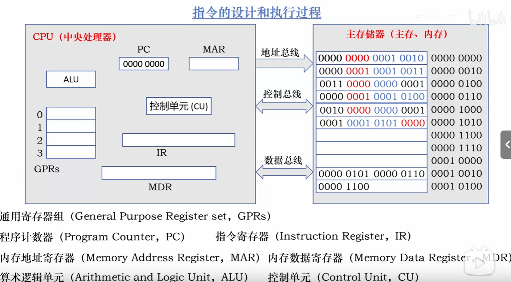
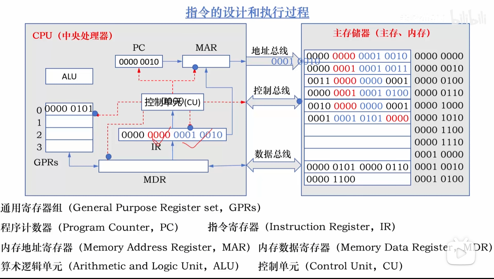
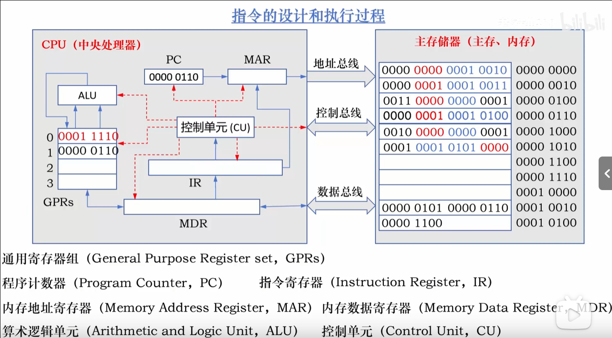
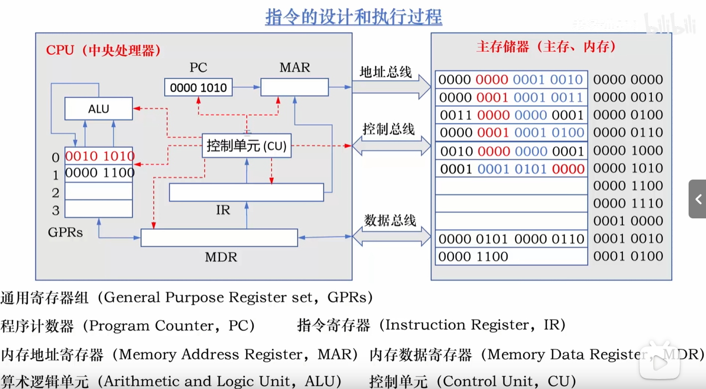
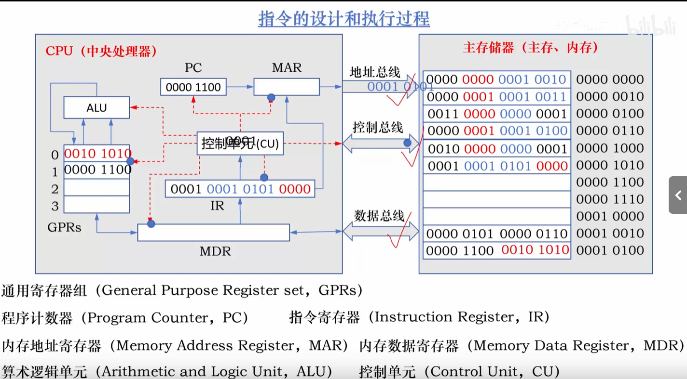

# notes_of_computer_organization
本人关于计算机organization的笔记
* 第一章: 计算机系统概述
    * 二进制,十进制和十六进制的转换.
    * 程序指令的设计过程和执行过程(初步了解)
    * 冯诺伊曼计算机结构的5个特点
    * 程序的编译过程
    * 计算机系统的三个性能指标
    * 计算机系统的三个性能评估
    * 理解程序员的抽象思想和分层思想
    * 恶补一下电路的基本知识
* 第二章: 总线系统
* 第三章: 主存储器
* 第四章: 数据的表示和运算
* 第五章: 指令系统
* 第六章: 中央处理器
* 第七章: 输入输出 (I/O) 系统

---
## 1.计算机系统概述
### 1.1 二进制,十进制和十六进制的转换
&emsp;无论是内存还是外存都是二进制进行存储.当把多个位组合起来,在加上某种解释.即赋予不同位的组合以不同的含义(ASCII,unicode).ACSII以8位来表示一个字母或者符号,人为规定,不过实际首位都是0,0作为保留位
&emsp;在计算机为存储器划分存储单元,一般8个位为一个单元,也就是一字节为一个单元.(后面一个单元就是一个地址).
* 二进制转十进制(略)
* 二进制转十六进制(略)
* 十进制转二进制(略)
* 十六进制转二进制(略)
* 人用十进制;存储用二进制;显示用十六进制
 
(转换是存在误差的)以前写物理的时候总是保留,分析误差,现在终于又一次感受到了误差的魅力.
### 1.2 程序指令(抽象的模型)
#### 设计过程:
&emsp;计算机内部的二进制不仅仅可以代表为ASCII和整数,也可以代表为指令.
常见的指令有:
* 取数指令
* 运算指令
* 存数指令
* 打印指令

一条指令也是二进制组合,常见就是指令操作码和地址码.下面举例,不是真正的操作码:
| 操作码 | 操作类型 |
|--|--|
|0000| 取数操作|
|0001| 存数操作|
|0010| 加法操作|
|0011| 乘法操作|
|0100| 打印操作|

操作码+目的地址+源地址:` 0000 0000 00010010`(假的).
#### 执行过程:
&emsp;CPU与主存中有三条总线:地址总线,控制总线,数据总线.

* GPRs是通用寄存器,CPU存放数据的地方.
* PC是程序计数器,用来存储下一条指令的地址.
* IR是指令寄存器,用来存储当前执行的指令.
* MAR是内存地址寄存器,用来接收PC储存的下一条指令的地址和**IR中指令中**的地址.
* MDR是内存数据寄存器,用来接收来自GPRs的数据和来自主存的数据.
* ALU是算术逻辑单元,由CU控制根据IR的指令取GPRs的数据进行运算
* CU是控制单元,所有流程的参与者和管理者.
 
**分析一个完整过程**:

第一个过程(读取其中一个数据):
1. 程序启动,将第一条指令放入PC中(CU控制)
2. PC的指令地址传给MAR(CU控制PC和MAR)
3. MAR通过地址总线把指令地址给主存(CU控制MAR和主存)
4. 主存将地址总线传来的指令地址与对应数据匹配,通过数据总线给MDR(CU控制)
5. MDR把指令传给IR(CU控制MDR和IR)
6. PC中的指令地址自动"+1".
7. CU读取IR中指令的操作码部分,发现是取数指令.把信息通过控制总线给主存
8. CU将IR中源地址给MAR(CU控制MAR和IR)
9. MAR通过地址总线将地址传给主存.
10. 主存根据控制总线和地址总线的数据,将对应地址中的数据通过数据总线传给MDR.
11. MDR根据IR的目的地址将数据传给GPRs(CU控制)
 

第二个过程(读取其中另一个数据):
1. PC的指令地址传给MAR(CU控制PC和MAR)
2. MAR通过地址总线把指令地址给主存(CU控制MAR和主存)
3. 主存将地址总线传来的指令地址与对应数据匹配,通过数据总线给MDR(CU控制)
4. MDR把指令传给IR(CU控制MDR和IR)
5. PC中的指令地址自动"+1".
6. CU读取IR中指令的操作码部分,发现是取数指令.把信息通过控制总线给主存
7. CU将IR中源地址给MAR(CU控制MAR和IR)
8. MAR通过地址总线将地址传给主存.
9. 主存根据控制总线和地址总线的数据,将对应地址中的数据通过数据总线传给MDR.
10. MDR根据IR的目的地址将数据传给GPRs(CU控制)

第三个过程(将俩数据相乘)
1. PC的指令地址传给MAR(CU控制PC和MAR)
2. MAR通过地址总线把指令地址给主存(CU控制MAR和主存)
3. 主存将地址总线传来的指令地址与对应数据匹配,通过数据总线给MDR(CU控制)
4. MDR把指令传给IR(CU控制MDR和IR)
5. PC中的指令地址自动"+1".
6. CU读取IR中指令的操作码部分,发现是乘法指令. 
7. CU根据IR的俩个源地址,将GPRs对应的数据传送给ALU,同时让其执行乘法.
8. CU将ALU的结果根据IR的目的地址储存在GPRs对应的位置.

第四个过程(将数据存放主存)
1. PC的指令地址传给MAR(CU控制PC和MAR)
2. MAR通过地址总线把指令地址给主存(CU控制MAR和主存)
3. 主存将地址总线传来的指令地址与对应数据匹配,通过数据总线给MDR(CU控制)
4. MDR把指令传给IR(CU控制MDR和IR)
5. PC中的指令地址自动"+1".
6. CU读取IR中指令的操作码部分,发现是存数指令.把指令信息通过控制总线传给主存
7. CU根据IR的源地址,将GPRs对应的数据传送给MDR.
8. CU将IR的目的地址传给MAR
9. MAR将目的地址传给主存
10. MDR将来自GPRs的数据通过数据总线传给主存
11. 主存通过数据总线,控制总线已经地址总线将对应的数据存放对应的地址.

整个过程其实解决了我的疑问:PC为什么是存储下一条指令,PC在什么时间点自动加1.
### 1.3 冯诺伊曼计算机结构的5个特点

